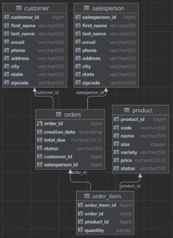

# Introduction
This project is focused on Java Database Connectivity (JDBC) API and showing how to use it to read and manage data from relational databases in applications programmed with Java. This project works by first creating a database, with the following [properties](#er-diagram), inside a containerized PostgreSQL database. Then connecting the JDBC to the psql database via the `DatabaseConnectionManager` class. The `Customer` class, which implements the `DataTransferObject` interface, generates a customer object that represents an item from the Customer table. The `CustomerDAO` class, which extends `DataAccessObject`, handles the data manipulation in regards to the Customer table. Maven is used as the project manager.

# Implementaiton
## ER Diagram

## Design Patterns
This project uses a DAO and Repository design pattern. The DAO provides abstraction between the JDBC and the rest of the code. The DTO is the model. In this implementation, the DAO works together with the DTO. The Customer DTO fully encapsulates the Customer Table. The Customer DAO handles the CRUD operations in regards to interactions between the Customer DTO and Customer Table. The repository pattern focuses on single-table access per class. This project follows the repository pattern as the classes created only interact with the customer table. The repository pattern also focuses on joining in the database rather than joining in the code.

# Test
The docker container was tested through the command line and the DDL commands were tested through the IntelliJ IDE Database tool. The DAO class was tested manually through the JDBCExecutor class by comparing the returning result to the expected result via the IntelliJ Database tool. Used `self4j` to log messages while testing.