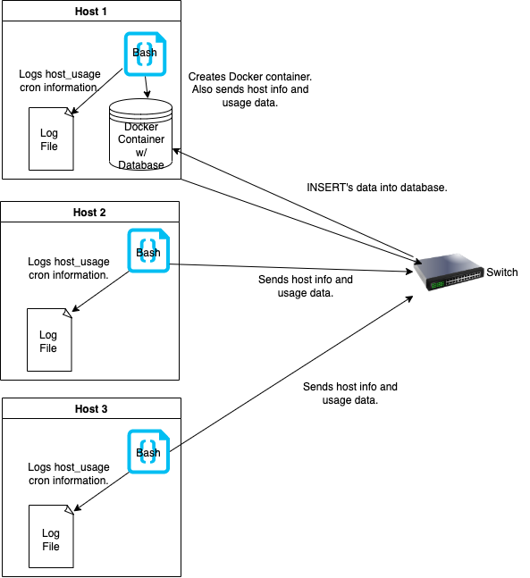

# Introduction
This project is a minimum viable product that manages a cluster of nodes/servers running CentOS 7. It tracks each node?s hardware information as well as usage. This project was designed for the Jarvis Linux Cluster Administration, so the team could examine and produce reports based on server usage. This project uses technologies such as:
- Bash
- Postgres
- Docker
- Git
- CentOS 7

# Quick Start
```console
#In Project Root Directory

  #Create and Start Instance
  ./scripts/psql_docker.sh create [db_username] [db_password]
  ./scripts/psql_docker.sh start
  
  #Create Database Tables
  psql -h <psql_host> -U <db_username> -d host_agent -f sql/ddl.sql
  
  #Insert Host Hardware information into the database
  ./scripts/host_info.sh <psql_host> 5432 host_agent <db_username> <db_password>
  
  #Edit crontab jobs to execute host_usage script.
  > crontab -e
    
  #add this to crontab
    * * * * * bash /<PATH_TO_ROOT_FOLDER>/scripts/host_usage.sh <psql_host> 5432 host_agent <db_username> <db_password> > /tmp/host_usage.log
```

# Implementation
Discuss how you implement the project.
## Architecture


## Scripts
- psql_docker.sh:: Creates a PSQL docker container with the given username and password. Also can start and stop the container
  - ```console
    ./scripts/psql_docker.sh start|stop|create [db_username][db_password]
    ```
- host_info.sh:: Inserts host hardware information to the database(host_info).
  - ```console
    ./scripts/host_info.sh <psql_host> <psql_port> host_agent <db_username> <db_password>
    ```
- host_usage.sh:: Inserts host usage information to database(host_usage).
  - ```console
      ./scripts/host_usage.sh <psql_host> 5432 host_agent <db_username> <db_password>
    ```
- crontab
  - ```console
    #edit crontab jobs
    bash> crontab -e
    
    #add this to crontab
    * * * * * bash /<PATH_TO_ROOT_FOLDER>/scripts/host_usage.sh <psql_host> 5432 host_agent <db_username> <db_password> > /tmp/host_usage.log
    ```
- ddl.sql:: Creates tables inside of database.
  - ```console
    psql -h <psql_host> -U <db_username> -d host_agent -f sql/ddl.sql
    ```
- queries.sql
  - The first query allows host information to be selected and grouped based on CPU numbers. The hosts with the highest total memory will be listed first.
  - The second query uses two helper functions to find the average used memory (in percentage) over 5-minute intervals for each host.
  - The third query detects when there has been a server failure for each host. (It's assumed that a server fails when it inserts less than 3 data points within a 5-minute interval).

## Database Modeling
Table schemas
- `host_info`

  Column|Type|Description
    ---|---|---
  id|`SERIAL PRIMARY KEY`|Database ID
  hostname|`VARCHAR UNIQUE`|Name of host
  cpu_number|`INT`|Number of CPUs
  cpu_architecture|`INT`|CPU architecture
  cpu_model|`VARCHAR`|Name of CPU model
  cpu_mhz|`INT`|Clock speed of CPU in MHz
  L2_cache|`INT`|Size of L2 cache in kB
  total_mem|`INT`|Total memory in kB
  timestamp|`TIMESTAMP`|Time this data was collected

- `host_usage`

Column Name|Data Type|Description
---|---|---
timestamp|`TIMESTAMP`|Time this data was collected (NOT NULL)
host_id|`SERIAL FOREIGN KEY REFERENCES host_info(id)`|ID of host in host_info table. (NOT NULL)
memory_free|`INT`|Amount of free memory in MB (NOT NULL)
cpu_idle|`INT`|Percentage of time CPU spent idle (NOT NULL)
cpu_kernel|`INT`|Percentage of time CPU spent used by kernel (NOT NULL)
disk_io|`INT`|Number of disk I/O (NOT NULL)
disk_available|`INT`|Amount of available disk space in MB (NOT NULL)

# Test
The SQL queries and Bash scripts were tested using the CLI as well as the IntelliJ Database tool. The Queries test results were successful with the Database tool listing the correct rows for the queries. The Bash script testing and cronjob testing were also successful, correctly inserting the rows into the desired tables. The docker instance creation and start/stop function were successfully tested using the `docker container ls -a -f name=jrvs-psql
` and `docker ps -f name=jrvs-psql` to verify if it was created and running.

# Deployment
The app source is deployed to this GitHub repository. Testing/Deployment was done on a Jarvis Remote Desktop running CentOS 7.

# Improvements
- More thorough testing for the SQL queries. Would also like to automate it.
- Better comments to be more descriptive of what certain code chunks are doing.
- Add a cron job to update host_info every week. This is because the hardware in the hosts can be changed and there is no way to automatically update the information.